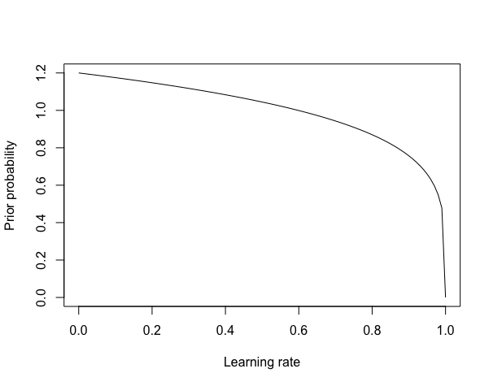
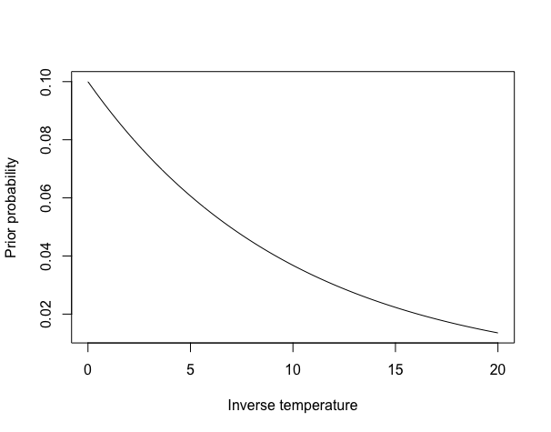

# Maximum A Posteriori (MAP) estimation: *Q*-learning

## A very brief introduction to Bayesian estimation

In the first step, the focus was on writing a *Q*-learning likelihood function that specified the likelihood of a particular subject's choices under a basic *Q*-learning algorithm.

This helped us to estimate some parameters for each participant, but what you might have noticed is that some of these parameter values (especially for the  parameter) were very large. This is symptomatic of an issue that can arise with MLE estimation, which is that the parameter values can be underconstrained by the data (i.e., the data does not give quite enough information to estimate parameters with high precision).

One way of dealing with this is to move to a Bayesian estimation framework. In a Bayesian framework, there are two factors that influence the inferred probability that a parameter takes on particular values: the first is the likelihood, as in MLE, but the second is the *prior probability* of different parameter values.

To get an intuition for this, consider the following example: you walk into your house and turn on a light switch, but the light does not come on (this is our *observed data*). You consider two hypotheses: first, the bulb has blown, or, second, an intruder has cut the power to your house. These two hypotheses assign the same *likelihood* to the observed data (since the light not coming on is exactly what would be predicted under both hypotheses). However, intuitively, we have a sense that the blown-bulb explanation is more plausible. How can we resolve this with the fact that both hypotheses predict the data equally well?

The Bayesian answer to this question is that the blown-bulb hypothesis has a far higher *prior probability* than the intruder hypothesis. Consequently, when we observe a light that does not turn on, we should consider it far more likely that the bulb has blown than that an intruder has cut the wires. In a Bayesian framework, the plausibility of different hypotheses after observing data is called the *posterior probability*. Mathematically, we can write this down as follows:

This says that the posterior probability of some hypothesis is proportional to the product its prior probability and the likelihood of the data given the hypothesis. Given that we are working with log-likelihoods in our optimisation, it makes more sense to take the logarithm of both sides and express the right hand side as the sum of logarithmic terms:

## Maximum a-posteriori estimation

In MAP estimation, the goal is still to get a point estimate for each parameter: that is, a single number that best summarises what we think is the most likely value per parameter per participant. (As an side, this differs from full Bayesian estimation, where the goal is to get a *probability distribution* over different possible parameter values, but we will get to that at a later stage).

Concretely, what this means is that to do MAP estimation, we use the same likelihood function that we wrote for the MLE stage. But rather than passing this value into the optimiser directly, as in MLE, we pass in the *sum* of the log likelihood and the (log) prior probability of the parameter values. The resulting point estimate is then our MAP estimate of the parameters.

### Where do priors come from?

To a Bayesian, prior beliefs quantify the probability of different parameter values. But what should one do when one doesn't have an exact sense of the probability of different parameter values? In that case, the standard answer is that we should lean on conventional wisdom in the field. Helpfully, I can provide that to you in this case. (There is a different answer in the full hierarchical Bayesian setting, which again, we will get to later).

For the learning rate parameter  , we can use a  distribution, which looks like this:

This basically corresponds to saying that we think that lower learning rates are more likely than learning rates around 1, but without placing a super strong constraint on values below around 0.5.

For the softmax inverse temperature parameter , we will use a  distribution with a shape parameter of 1 and a rate parameter of 0.1, which looks like this:

This says that we believe that lower values of  are more likely in general, and that values above around 20 are very unlikely.

### Implementation

In order to implement this code, you will need to be able to express the probability density function of both a beta distribution and a gamma distribution within your chosen programming language. You then can calculate the prior probability of a particular parameter value by taking the value of this distribution at the parameter value.
